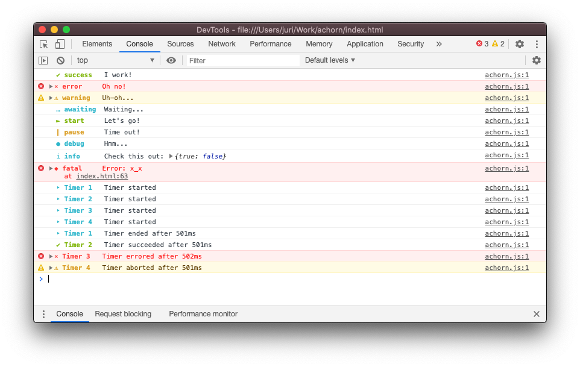
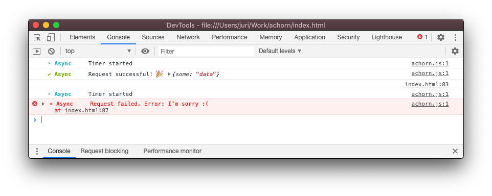

<p align="center">
    <a></a>
    <br>
    <a></a>
    <a></a>
    <a></a>
    <a></a>
    <a></a>
</p>

[`Achorn`](https://github.com/4dams/achorn) is a colorful, good-looking, fully customizable logging utility for the Browser. It is heavily inspired by [@klaussinani](https://github.com/klaussinani/signal)s [Signale](https://github.com/klaussinani/signale) logger for Node.js backend applications.



## Core Features

-   Fully customizable
-   No dependencies
-   Webpack Support (for Angular, React, ...)
-   Written and strongly typed in TypeScript
-   Easy to use **Timers**, e.g. for HTTP requests
-   ... you can even add your own loggers/prefixes!

## How to Install

_Installation Guide following soon..._

## How to use

The first thing after importing Achorn is creating a `new Achorn()` instance:

```js
// Without config
const achorn = new Achorn();

// With custom config
const achorn = new Achorn({
    showTimestamp: true,
    globalPrefix: [...]
});
```

Achorn takes an optional Config object as input. For all config options, see the [config interface file](src/interfaces/config.interface.ts).

After the initial setup, you can already use any of Achorns default loggers, which are defined in their dedicated prefixes file. Optionally, you can add your own prefixes/loggers by providing them in the `prefixes` field in the Config.

## Timers

The most common use for Timers in Achorn are probably HTTP requests. Here's an example implementation:

```js
// Create new Timer called "Async"
const timer = achorn.timer("Async");

// Make request
request("https://google.com")
    .then((res) => {
        // End timer with success message
        timer.success("Request successful! 🎉", res);
    })
    .catch((err) => {
        // End timer with error message
        timer.error("Request failed.", err);
    });
```



## Local Development

After cloning the repository, all you have to do is run `npm run watch` to start Webpack in watch mode, which will listen for file changes and rebuild Achorn accordingly.

Then, simply open the `index.html` of this project in the browser!
